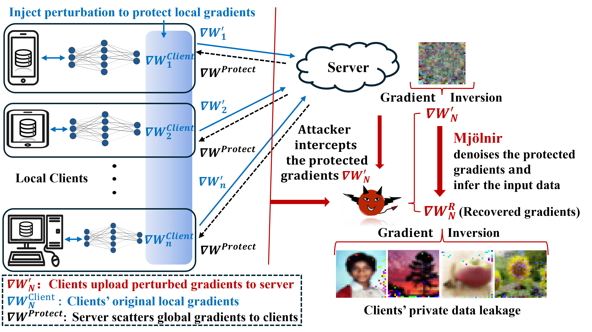
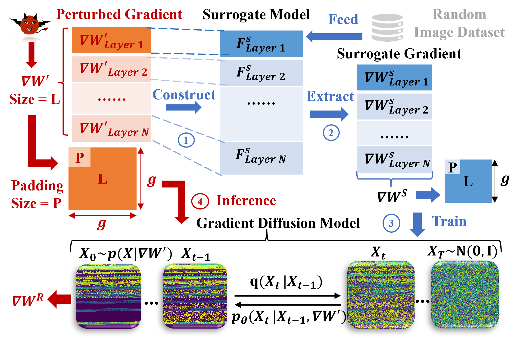
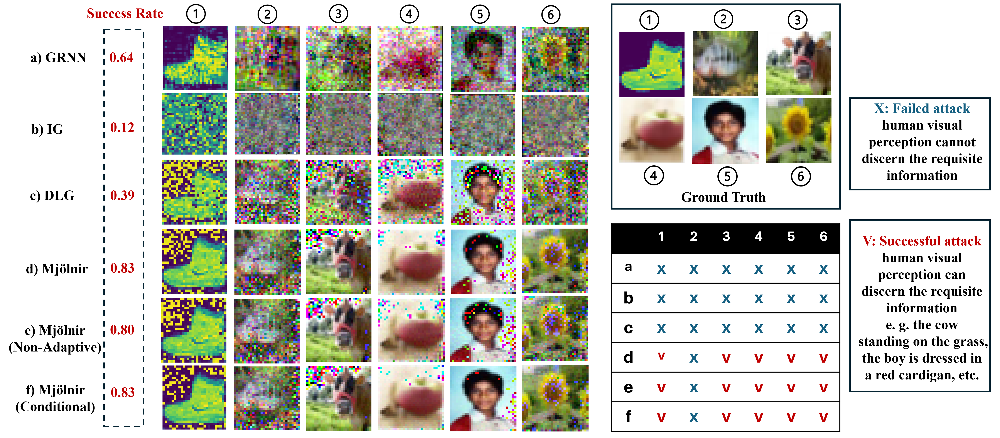
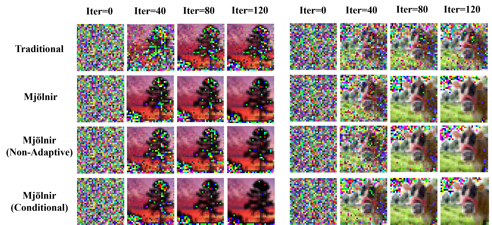

# **Mjölnir: Breaking the Shield of Perturbation-Protected Gradients via Adaptive Diffusion**  

**Xuan Liu, Siqi Cai, Qihua Zhou, Song Guo, Ruibin Li, Kaiwei Lin**

**Full Paper Preprint**:  [https://arxiv.org/abs/2407.05285](https://arxiv.org/abs/2407.05285) 

---

## **Abstract**  
Perturbation-based mechanisms, such as differential privacy, mitigate gradient leakage attacks by introducing noise into the gradients, thereby preventing attackers from reconstructing clients' private data from the leaked gradients. However, can gradient perturbation protection mechanisms truly defend against all gradient leakage attacks?  

In this paper, we present the first attempt to break the shield of gradient perturbation protection in Federated Learning for the extraction of private information. We focus on common noise distributions, specifically Gaussian and Laplace, and apply our approach to DNN and CNN models.  

We introduce **Mjölnir**, a perturbation-resilient gradient leakage attack that is capable of removing perturbations from gradients without requiring additional access to the original model structure or external data. Specifically:  
- **Diffusion-Based Gradient Denoising**: We are the first to leverage the inherent diffusion properties of gradient perturbation to develop a novel diffusion-based gradient denoising model.  
- **Surrogate Client Model**: By constructing a surrogate client model that captures the structure of perturbed gradients, we obtain crucial clean gradient data for the attacker to train the gradient diffusion model.  
- **Adaptive Sampling Steps**: Monitoring disturbance levels during the reverse diffusion process enhances gradient denoising capabilities, generating gradients that closely approximate the original, unperturbed versions.  

**Key Results**: Extensive experiments demonstrate that **Mjölnir** effectively recovers the protected gradients and exposes the Federated Learning process to the threat of gradient leakage, achieving superior performance in gradient denoising and private data recovery.  

---

## **Mjölnir Overview**  

| **Threat Model**                     | **Methodology**                   |
|--------------------------------------|------------------------------------|
|           |         |

---

## **Experiments**  
---
### **Notes**

Our trained Gradient Diffusion Model is excluded from the provided code package. To successfully run the code, please follow these steps:

1. **Prepare Gradient Data**  
   Prepare your own clean gradient data to train the Gradient Diffusion Model. Detailed instructions for data preparation and model training are available in the *Methodology* section of our paper.  

2. **Train the Gradient Diffusion Model**  
   Train your Gradient Diffusion Model using the prepared data.

3. **Save the Trained Model**  
   Once training is complete, save the trained model in the folder named 'saved_train_models'.  

4. **Run the Code**  
   Execute `main.py`.

### **Experimental Setups**  

1. **Mjölnir Variant Attack Models**:  
   - **Mjölnir**: Trained with only unperturbed surrogate gradients.  
   - **Conditional Mjölnir**: Trained with both perturbed gradients and unperturbed surrogate gradients.  
   - **Non-Adaptive Mjölnir**: Without the adaptive process (perturbation scale $M$ is not used as an adaptive parameter during the gradient diffusion process).  

2. **Benchmarks and Datasets**:  
   - **Privacy Datasets**: MNIST, CIFAR100, and STL10 are used as client privacy datasets and serve as the ground truth for privacy leakage evaluation.  
   - **Unperturbed Gradients**: Gradients ($\nabla W$) from the local training model of the target client are used as the reference benchmark of gradient denoising under the FL-PP paradigm.  
   - **Training Dataset for Diffusion Model**: FashionMNIST gradients are used to train the Mjölnir gradient diffusion model.  

3. **Evaluation and Boundaries**:  
   - **Privacy Leakage Capability**:
     - **Image Average Peak Signal-to-Noise Ratio (PSNR)**: Measures the fidelity of recovered images.  
     - **Label Recovered Accuracy (LRA)**: Measures the accuracy of the recovered labels.  
     - **Success Definition**: The attack is successful if human visual perception can discern requisite information from recovered images.  
   - **Gradient Denoising Quality**:
     - **Cosine Similarity (CosSimilar)**: Measures the similarity between recovered gradients ($\nabla W^R$) and original gradients ($\nabla W$).  
     - **Gradient PSNR**: Measures the peak signal-to-noise ratio of recovered gradients compared to the original gradients.  

   Higher metric values indicate better recovery fidelity and gradient accuracy.  

### **Sample Results**

#### **Privacy Leakage Capability**

|    |      |
|-------------------------------|----------------------------------|
| **Compare with ground truth** | **Visualization via iterations** |

- **Visualization**: The images above compare the recovered private images between Mjölnir variants and traditional gradient leakage attacks like GRNN, IG, and DLG.  

#### **Gradient Denoising Quality**  

##### **Inference Time**  
Mjölnir demonstrates competitive inference efficiency compared to non-diffusion models. All experiments were conducted on the following hardware:  
- **GPU**: NVIDIA GeForce RTX 2060  
- **CPU**: Intel(R) Core(TM) i7-10870H @ 2.20GHz  

| **Model**                | **Inference Time (s)** |
|--------------------------|------------------------|
| **NBNet**                | 2.653                 |
| **SS-BSN**               | 26.15                 |
| **AP-BSN**               | 7.138                 |
| **Mjölnir**              | 6.834                 |
| **Mjölnir (Non-Adaptive)**| 6.834                 |
| **Mjölnir (Conditional)**| 6.917                 |

##### **Gradient Recovery Metrics**  
The table below summarizes the gradient denoising quality for various models across different datasets.   

| **Model**                | **MNIST** ($CosSimilar_{g}$ / $PSNR_g$) | **CIFAR100** ($CosSimilar_{g}$ / $PSNR_g$) | **STL10** ($CosSimilar_{g}$ / $PSNR_g$) |
|--------------------------|-----------------------------------------|-------------------------------------------|-----------------------------------------|
| **NBNet**                | 0.992 / 35.74                         | 0.979 / 27.51                             | 0.979 / 27.23                           |
| **SS-BSN**               | 0.995 / 32.35                         | 0.845 / 22.85                             | 0.845 / 22.84                           |
| **AP-BSN**               | 0.968 / 29.61                         | 0.892 / 24.01                             | 0.893 / 24.12                           |
| **Mjölnir**              | 0.996 / 38.76                         | 0.990 / 30.42                             | 0.990 / 30.01                           |
| **Mjölnir (Non-Adaptive)**| 0.995 / 38.59                         | 0.990 / 30.39                             | 0.990 / 29.87                           |
| **Mjölnir (Conditional)**| 0.996 / 38.78                         | 0.990 / 30.53                             | 0.993 / 30.22                           |

---

## **Contact**  
For any questions or collaboration inquiries, please feel free to contact:  
- **Xuan Liu**: [xuan18.liu@polyu.edu.hk](mailto:xuan18.liu@polyu.edu.hk)  
- **Siqi Cai**: [csiqi@whut.edu.cn](mailto:csiqi@whut.edu.cn)

